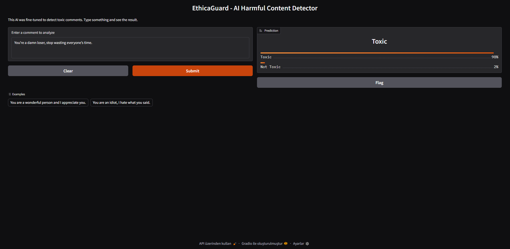

# 🛡️ EthicaGuard - AI-Powered Harmful Content Detector

A fine-tuned `DistilBERT` model built with PyTorch and Hugging Face Transformers to detect and classify toxicity, insults, and hate speech in text.

 ---

## 🎯 The Problem

With the rise of online anonymity, toxic comments, hate speech, and cyberbullying have become significant challenges for online platforms. Manual content moderation is often slow, emotionally taxing for moderators, and difficult to scale. This project aims to build an automated tool to assist in creating safer online communities by accurately identifying harmful content.

---

## ✨ Solution

**EthicaGuard** is a Deep Learning model that has been fine-tuned on a large dataset of social media comments to understand the nuances of toxic language. It leverages a pre-trained `DistilBERT` model, making it both lightweight and powerful, capable of classifying text in real-time.

---

## 🛠️ Tech Stack

* **Programming Language:** Python
* **Core Frameworks & Libraries:**
    * PyTorch (for Deep Learning)
    * Hugging Face `Transformers` (for model loading and fine-tuning)
    * Hugging Face `Datasets` (for data loading and processing)
    * Hugging Face `Evaluate` (for performance metrics)
* **Training Environment:** Google Colab (with free GPU)
* **Demo Framework:** Gradio (for the interactive web demo)

---

## ⚙️ How to Run

To run this project on your own machine or in Google Colab:

1.  **Clone the repository:**
    ```bash
    git clone [https://github.com/HamidOmarov/EthicaGuard-AI-Content-Moderator.git](https://github.com/HamidOmarov/EthicaGuard-AI-Content-Moderator.git)
    ```
2.  **Open the Notebook:**
    Upload and open the `EthicaGuard_Project.ipynb` file in Google Colab.
3.  **Run the cells:**
    Execute the cells sequentially. The notebook will handle installing dependencies, downloading the dataset, fine-tuning the model, and launching the Gradio demo. The training process takes approximately 15-20 minutes on a T4 GPU.

---

## 📊 Model Performance

The model was evaluated on a test set held out from the `civil_comments` dataset. The performance metrics are as follows:

| Metric      | Value   |
|-------------|---------|
| ✅ Accuracy  | 0.9524  | | 🎯 Precision | 0.8810  | | 🔄 Recall    | 0.7532  | | ⚖️ F1 Score   | 0.8121  | ---

## 🚀 Future Improvements

* **Fine-tune a larger model:** Experiment with larger architectures like `BERT-base` or `RoBERTa` for potentially higher accuracy.
* **Multi-label classification:** Extend the model to classify content into multiple categories (e.g., `insult`, `threat`, `obscene`) simultaneously.
* **Deploy to Hugging Face Spaces:** Deploy the Gradio app to Hugging Face Spaces for a permanent, live demo.
